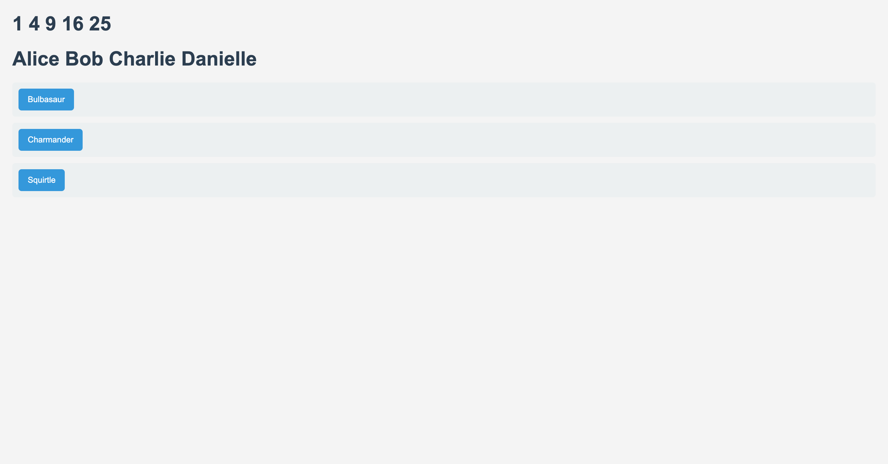

# Scrimba React - Defining Variables

This project focuses on defining variables in React using `const`. Understanding how to properly define and manage variables is essential for effective React development.

## Visual Design



## Getting Started

To run this project locally, follow these steps:

1. Clone the repository:

   ```bash
   git clone https://github.com/BhoomiGohil/Scrimba-React-DefiningVariables.git
   ```

2. Navigate to the project directory:

```bash
   cd Scrimba-React-DefiningVariables
```

3. Install the required dependencies:

```bash
npm install
```

4. Start the development server:

```bash
npm start
```

5. Open your browser and go to `http://localhost:3000` to view the application.

## Overview of the Code

1. Variables: The project demonstrates different ways to define variables in JavaScript and React.
2. Functional Components: The code uses functional components to showcase variable usage within the component's scope.

## Technologies Used

React
JavaScript
CSS

## Styles

The project includes a basic CSS file that styles the main content, headings, paragraphs, and buttons. It provides a clean and responsive design for better user experience.
